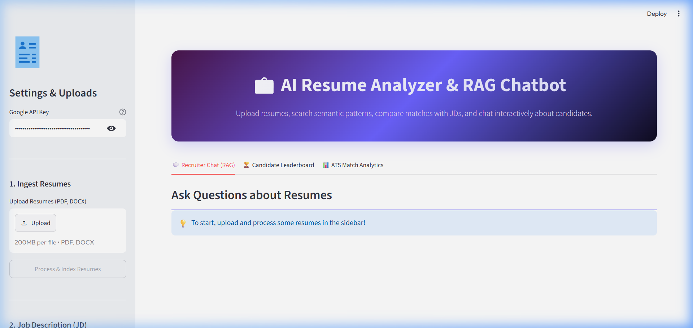
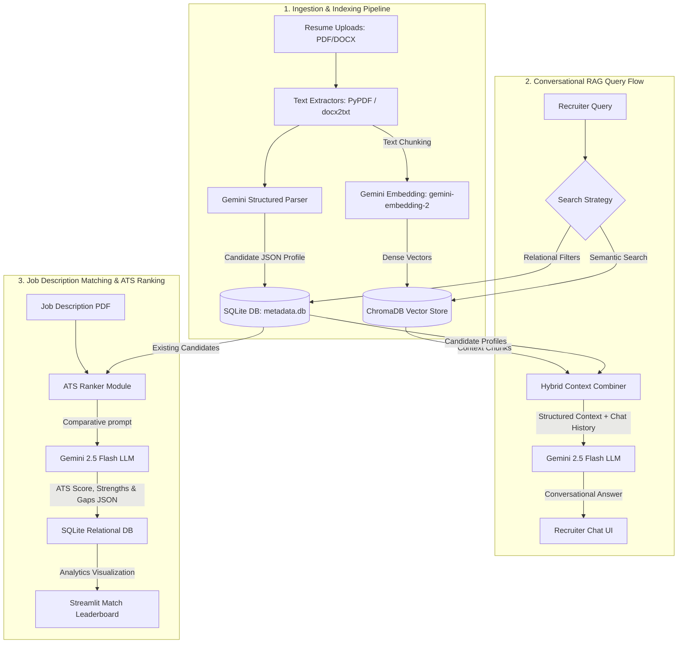

# 💼 AI Resume Analyzer and RAG Chatbot

An AI-powered, production-ready recruiter dashboard, resume analyzer, and conversational RAG (Retrieval-Augmented Generation) chatbot. Built using **Streamlit**, **LangChain**, **SQLite**, **ChromaDB**, and **Google Gemini 2.5 Flash / Gemini Embedding 2**.

---

## 🖥️ Application UI Preview



---

## 🏗️ System Architecture & Workflow

The system implements a **hybrid storage architecture**: relational metadata is tracked in a SQLite database, while document embeddings are stored in ChromaDB. This allows the recruiter to perform both exact database filtering (e.g., matching experience years) and semantic search (e.g., identifying conceptual skills) simultaneously.



---

## ⚙️ Core Operations

### 1. Multi-Resume Ingestion & Parsing
*   **Text Extraction**: Ingests multiple `.pdf` and `.docx` resumes. Handles extraction using `pypdf` for PDFs and `docx2txt` for Word documents.
*   **Structured Information Extraction**: Uses **Gemini 2.5 Flash** with structured output parsing (Pydantic schemas) to extract detailed candidate summaries:
    *   Candidate Name & Email
    *   Core Skills & Technologies
    *   Years of Experience
    *   Education & Academic Details
    *   Resume Quality Score (1-10 scale)
    *   Professional Executive Summary
*   **Database Ingestion**: Writes parsed profiles into SQLite (`database/metadata.db`) and commits text chunks with metadata to ChromaDB (`chroma_db/`).

### 2. Conversational RAG Chatbot
*   **Semantic Queries**: Retrieve candidates through semantic prompts, e.g., *"Find developers who have built microservices with Python and FastAPI"* or *"Show candidates with database performance tuning experience"*.
*   **SQLite Metadata Join**: Merges semantic chunk retrieval from ChromaDB with candidate profile records from SQLite to display candidate details side-by-side with conversational answers.
*   **Memory Retention**: Maintains context across multiple conversational turns using LangChain memory structures.

### 3. Interactive Leaderboard
*   **Relational Filtering**: Search and filter candidate profiles dynamically by Name, Skills, and Minimum Experience.
*   **Export Capabilities**: Generate and download the entire parsed SQLite index dynamically as a `.csv` spreadsheet.

### 4. ATS Job Description (JD) Matcher
*   **Comparative Score**: Compares all candidates in the database against an uploaded Job Description PDF.
*   **Feedback Isolation**: Computes match percentages, isolates candidates' structural **strengths** relative to the job requirements, highlights **skill gaps**, and provides tailored recommendations.
*   **Interactive Visualizations**: Generates rich bar charts ranking compatibility scores.

---

## 🛠️ Technology Stack

| Component | Technology | Description |
| :--- | :--- | :--- |
| **Frontend UI** | `Streamlit` | Interactive dashboard layout and UI rendering |
| **Orchestration** | `LangChain` | RAG retrieval chain, memory management, and parser schema definitions |
| **LLM Model** | `Gemini 2.5 Flash` | Handles structured data parsing, ATS evaluation, and chatbot responses |
| **Embedding Model**| `Gemini Embedding 2` | Generates 3072-dimension dense vectors for semantic text chunks |
| **Vector Database** | `ChromaDB` | Vector store for chunk indexing and cosine-similarity searches |
| **Relational DB** | `SQLite` | Persistent storage for parsed profiles, ATS scores, and metrics |

---

## 🚀 Installation & Local Execution

### Pre-requisites
*   **Python 3.10+**
*   **Google Gemini API Key** (Get one at [Google AI Studio](https://aistudio.google.com/))

### 1. Setup Environment
Clone the repository and navigate to the project directory:
```bash
git clone https://github.com/Naveen2424k/chatbot.git
cd chatbot/resume-rag
```

Create and activate a virtual environment:
```bash
# Windows
python -m venv venv
.\venv\Scripts\Activate.ps1

# macOS/Linux
python -m venv venv
source venv/bin/activate
```

### 2. Install Dependencies
```bash
pip install -r requirements.txt
```

### 3. Configure Credentials
Create a `.env` file in the root of the `resume-rag/` directory:
```env
GOOGLE_API_KEY=your_actual_gemini_api_key_here
```

### 4. Run the Dashboard
```bash
streamlit run app.py
```
The application will launch and open in your default browser at `http://localhost:8501`.

---

## 🔧 Troubleshooting & IDE Setup

### Resolving IDE Import Errors
If your IDE displays missing module warnings for packages like `streamlit` or `langchain`:
1. Ensure your IDE is using the project's virtual environment.
2. In **VS Code**: Press `Ctrl + Shift + P` -> **Python: Select Interpreter** -> select the path `e:\chatbot\resume-rag\venv\Scripts\python.exe`.
3. The workspace configurations are saved in [.vscode/settings.json](.vscode/settings.json) to do this automatically.
